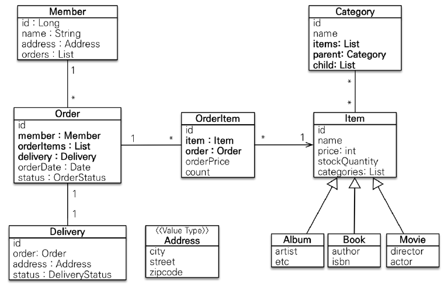

# 스프링 부트와 JPA 활용 1- 웹 애플리케이션 개발

    강의를 바탕으로 알게 된 내용을 정리합니다.

## 목차

1. 프로젝트 환경설정
2. 도메인 분석 설계
3. 애플리케이션 구현 준비
4. 회원 도메인 개발
5. 상품 도메인 개발
6. 주문 도메인 개발


### 2. 도메인 분석 설계



<br>

회원 엔티티
```java
// Member.java

@Entity
@Getter @Setter
public class Member {

@Id // 식별자(PK)를 의미한다.
@GeneratedValue // 시퀀스와 같이 1씩 증가하도록 한다.
@Column(name = "member_id") // 해당 컬럼 명을 명시한다.
private Long id;

private String name;

@Embedded // 내장된 객체 타입임을 알린다.
private Address address;

// 회원과 주문의 관계는 1:N이다.
// 연관 관계의 주인이 아닌 쪽에 mappedBy를 명시해준다. (FK가 있는 쪽이 주인이 된다.)
// member는 연관 관계의 주인의 필드명을 의미한다.
@OneToMany(mappedBy = "member") 
private List<Order> orders = new ArrayList<>();

}
```

<br>

주소
```java
// Address.java
@Embeddable
@Getter
public class Address {
    // 변경이 불가능하도록 setter()를 없애고 생성자로 값을 할당하도록 한다.
    private String city;
    private String street;
    private String zipcode;

    // 암묵적으로 객체 생성이 불가능함을 알린다.
    protected Address() {}

    public Address(String city, String street, String zipcode) {
        this.city = city;
        this.street = street;
        this.zipcode = zipcode;
    }
}
```

<br>

주문 엔티티
```java
// Order.java
@Entity
@Table(name = "orders") // order는 DB상 예약어이다.
@Getter @Setter
public class Order {

  @Id @GeneratedValue
  @Column(name = "order_id")
  private Long id;

  @ManyToOne(fetch = FetchType.LAZY)
  @JoinColumn(name = "member_id") // FK가 있는 곳에서 지정
  private Member member;  // 주문 회원

  // 주문과 상품은 N:M 관계
  // 따라서 중간에 OrderItem 테이블을 두었다.
  @OneToMany(mappedBy = "order", cascade = CascadeType.ALL)
  private List<OrderItem> orderItems = new ArrayList<>(); // 주문 상품

  // 1:1 관계에서는 자주 접근하는 테이블에서 join을 걸어준다.
  @OneToOne(fetch = FetchType.LAZY, cascade = CascadeType.ALL)
  @JoinColumn(name = "delivery_id")
  private Delivery delivery; // 배송 정보

  private LocalDateTime orderDate; // 주문 시간

  // EnumType.STRING을 항상 확인하자.
  // EnumType.ORDINAL의 경우 1, 2와 같이 숫자 값이 부여된다. (추후 문제 발생 위험)
  @Enumerated(EnumType.STRING)
  private OrderStatus status; // 주문상태 [ORDER, CANCEL]

  // 연관 관계 메서드

  public void setMember(Member member) {
    this.member = member;
    member.getOrders().add(this);
  }

  public void addOrderItem(OrderItem orderItem) {
    orderItems.add(orderItem);
    orderItem.setOrder(this);
  }

  public void setDelivery(Delivery delivery) {
    this.delivery = delivery;
    delivery.setOrder(this);
  }
}
```

<br>

주문 상태
```java
// OrderStatus.java
public enum OrderStatus {
    ORDER, CANCEL
}
```

<br>

주문 상품 엔티티
```java
@Entity
@Getter @Setter
public class OrderItem {

    @Id @GeneratedValue
    @Column(name = "order_item_id")
    private Long id;

    // 주문 테이블과 1:N관계
    @ManyToOne(fetch = FetchType.LAZY)
    @JoinColumn(name = "order_id")
    private Order order;

    // 상품 테이블과 1:N관계
    @ManyToOne(fetch = FetchType.LAZY)
    @JoinColumn(name = "item_id")
    private Item item;
    
    private int orderPrice; // 주문 가격
    private int count; // 주문 수량
}
```

<br>

상품 엔티티
```java
@Entity
@Inheritance(strategy =  InheritanceType.SINGLE_TABLE)
@DiscriminatorColumn(name = "dtype")
@Getter @Setter
public abstract class Item {

    @Id @GeneratedValue
    @Column(name = "item_id")
    private Long id;

    private String name;
    private int price;
    private int stockQuantity;

    @OneToMany(mappedBy = "item")
    private List<CategoryItem> categories = new ArrayList<>();
}
```

<br>

앨범 엔티티
```java
@Entity
@DiscriminatorValue("A")
@Getter @Setter
public class Album extends Item{
    private String artist;
    private String etc;
}
```

<br>

책 엔티티
```java
@Entity
@DiscriminatorValue("B")
@Getter @Setter
public class Book extends Item{
    private String author;
    private String isbn;
}
```

<br>

영화 엔티티
```java
@Entity
@DiscriminatorValue("M")
@Getter @Setter
public class Movie extends Item{
    private String director;
    private String actor;
}
```

<br>

카테고리 엔티티

```java
@Entity
@Getter @Setter
public class Category {

  @Id @GeneratedValue
  @Column(name = "category_id")
  private Long id;

  private String name;

  @OneToMany(mappedBy = "category")
  private List<CategoryItem> categoryItems = new ArrayList<>();

  // 여러 하위 카테고리가 하나의 상위 카테고리를 갖는다.
  @ManyToOne(fetch = FetchType.LAZY)
  @JoinColumn(name = "parent_id")
  private Category parent;

  // 하나의 상위 카테고리가 여러 하위 카테고리를 갖는다.
  @OneToMany(mappedBy = "parent")
  private List<Category> child = new ArrayList<>();

  // 연관 관계 메서드
  public void addChild(Category child) {
    this.child.add(child);
    child.setParent(this);
  }

  public void addCategory(CategoryItem categoryItem) {
    categoryItems.add(categoryItem);
    categoryItem.setCategory(this);
  }
}
```

<br>

카테고리 아이템 엔티티
```java
@Entity
@Getter @Setter
public class CategoryItem {

    @Id @GeneratedValue
    @Column(name = "category_item_id")
    private Long id;

    @ManyToOne(fetch = FetchType.LAZY)
    @JoinColumn(name = "category_id")
    private Category category;

    @ManyToOne(fetch = FetchType.LAZY)
    @JoinColumn(name = "item_id")
    private Item item;
}
```

<br>

엔티티 설계 주의점
- 엔티티에는 가급적 Setter를 사용하지 말자.
  Setter가 모두 열려있다면 변경 포인트가 너무 많아 유지 보수가 어렵다.
- 모든 연관 관계는 지연 로딩
  1. 죽시로딩(EAGER)은 예측이 어렵다(연관된 데이터를 다 끌고오기 때문). 어떤 sQL이 실행될 지 추적이 어렵다. 
  2. 실무에서 모든 연관 관계는 지연로딩(LAZY)로 설정한다.
  3. 연관된 엔티티를 함께 DB에서 조회해하 하면 fetch join 또는 엔티티 그래프 기능을 사용한다.
  4. @xToOne 관계는 디폴트 값이 즉시 로딩이므로 직접 지연로딩으로 설정해야 한다.
- 컬렉션은 필드에서 초기화 하자.
  1. null 문제에서 안전하다.
  2. 하이버네이트는 엔티티를 영속화 할 때 컬렉션을 감싸서 하이버네이트가 제공하는 내장 컬렉션으로 변경한다. 만약 getOrders()처럼 임의의 메서드에서 컬렉션을 잘못 생성하면 하이버네이트 내부 메커니즘에 문제가 발생할 수 있다. 
  